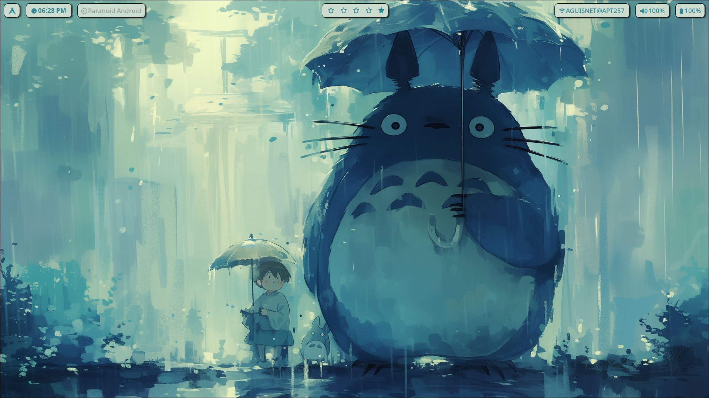
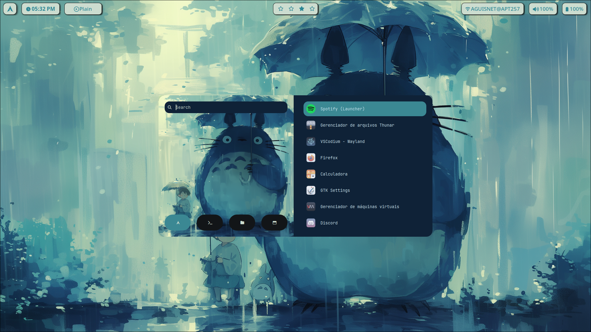
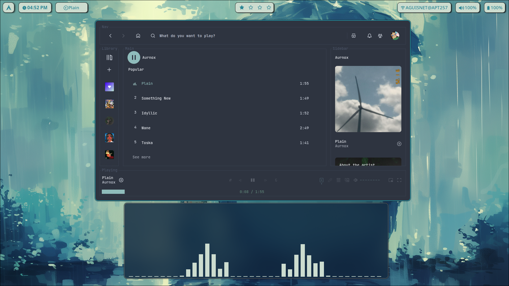
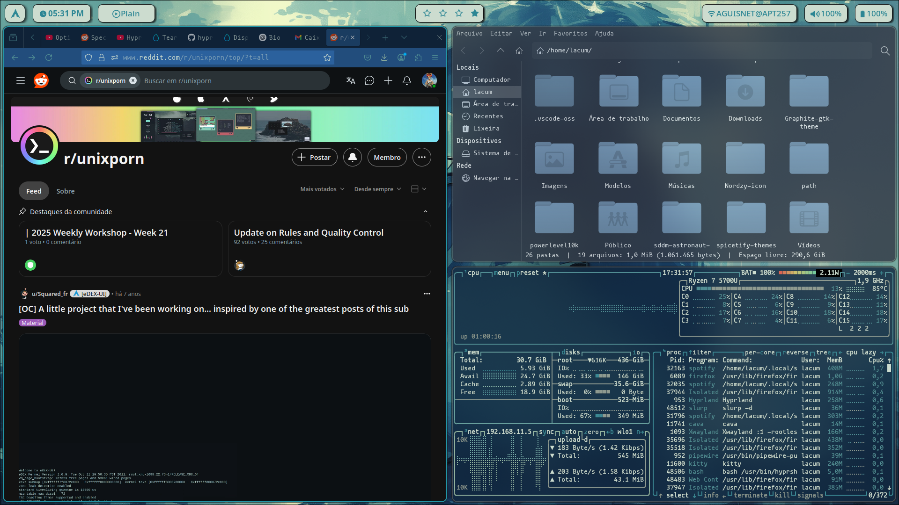

<h1 align="center">
  🍃 Totoro-inspired Arch Linux Rice 🌱
</h1>

  

---

## 📝 Note

These dotfiles are tailored for my personal Arch Linux setup using **Hyprland** on **Wayland**,  
with a focus on a clean, themed, and lightweight environment.  
Everything is configured manually and reproducibly through a script that installs packages and applies theming.

The goal here is to have a **custom system that reflects my workflow and aesthetic**, while keeping it minimal and efficient.  
The file `packages.txt` documents what each package is used for — and only what's truly needed stays.

Feel free to use this as reference, but keep in mind this is a personal project.

---

## ⚙️ Components

- **WM:** Hyprland
- **Status Bar:** Waybar
- **Application Launcher & Power Menu:** Rofi
- **Terminal:** Kitty
- **File Manager:** Thunar
- **Shell:** Zsh + Oh My Zsh + Powerlevel10k
- **Notification Daemon:** Swaync
- **Login Manager:** SDDM 
- **Wallpaper Manager:** swww
- **Color Scheme:** Pywal + Pywalfox (auto based on wallpaper)
- **GTK Theme:** Graphite-blue-Dark-nord (Graphite-gtk-theme)
- **Icon Theme:** Nordzy Icon
- **Fonts:** Mononoki Nerd Font

---

## 🖼️ Screenshots

---

## 🌸

This was my **first rice**, and it was a really fun experience to build and shape it from scratch.  
My goal was to have only what I need, with full control over every detail — it's my space, my environment.  
If you found something useful here or decide to use any part of it, I hope you enjoy it too —  
**like a cozy forest spirit taking care of things.**